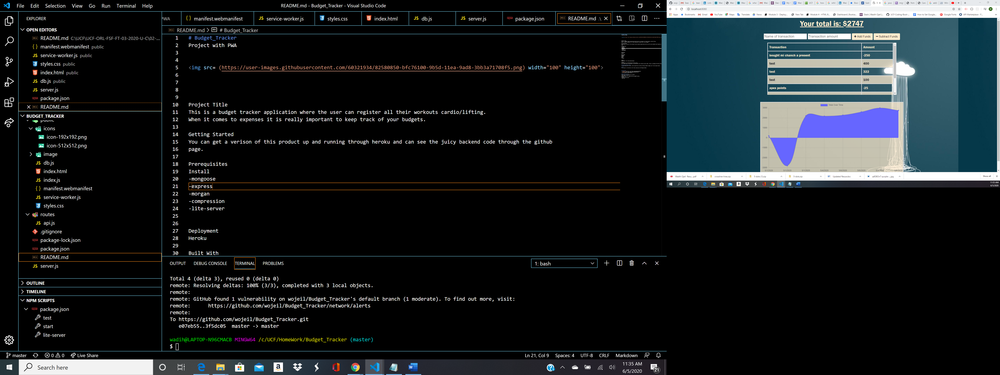

# Budget_Tracker
Project with PWA

Project Title
This is a budget tracker application where the user can register all their workouts cardio/lifting.
When it comes to expenses it is really important to keep track of your budgets. 

Getting Started
You can get a verison of this product up and running through heroku and can see the juicy backend code through the github
page.

Prerequisites
Install
-mongoose
-express
-morgan
-compression
-lite-server

Deployment
Heroku

Built With
Mongoose
Express
Morgan
PWA
indexDB

Authors
Wadih Ojeil- Full Stack Web Developer

License
This project is licensed under the ISC License
Full Stack Project. The project is in MVC format that includes the User model. Project is designed with PWA including indexDB.

## Purpose and Inspiration
Training experience to make a useful application with PWA including indexDB. Budget your life and spend smarter.

## MVC
This project is structured in Full Stack Javascript with Mongoose Models. 

## Tech Stack
+ [MONGOOSE ORM](https://www.npmjs.com/package/mongoose)
+ [EXPRESS](https://www.npmjs.com/package/express)
+ [NODE](https://nodejs.org/en/)

#### Install and run
Install all the dependencies with NPM
`npm install`  
Make sure you start Mongod and have mongoDB running..
`mongod`  
Then start the project
`npm start`

